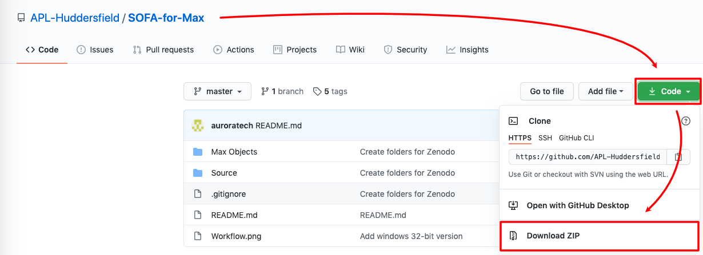
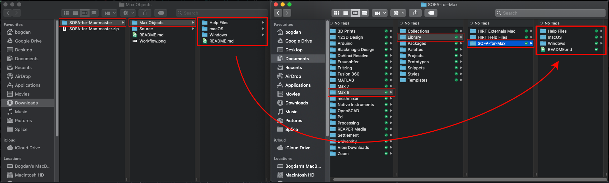

# Objective grading test for spatial impression attributes in a concert hall
## Prerequisites:

1. Install the CH340 USB-Serial driver. Instructions for Mac and Windows are available here: https://sparks.gogo.co.nz/ch340.html
2. Install Max/MSP: https://cycling74.com/downloads You don't need a subscription in order to run the test. After the 30 day trial you can still run any patch but without being able to save.
3. Install the APL SOFA-for-Max object: https://github.com/APL-Huddersfield/SOFA-for-Max.

  - Download the ZIP file:  
  

  - Extract the files and move the content of the "Max Objects" folder into a newly created folder in Max/Library
  

## Connecting the head tracker to Max

1. Connect the head tracker to the computer using a USB-Mini-B cable.
2. Locate the "Head Tracking" section in the upper-left corner of the Max patch.
3. Select the "wchusbserial1410" option in the dropdown menu; If you can not find the option, press the refresh button and it should now appear. If it still does not appear please make sure that you installed the CH340 drivers correctly and logged out or restarted the machine such that changes were applied.

4. Activate the head tracking by pressing the "Tracker On/Off" button.

## Calibrating the head tracker

- Every time you mount the head tracker to a new position you **need** to follow the following steps in order to calibrate the head tracker.

1. Position your head looking straight ahead at your screen.
2. Press the button located on top of the head tracker for longer than 1 second.
3. Position you head again to look down at the floor.
4. Short-press the calibration button (< 1s).

- Now the head tracker is calibrated for the specific position it is currently mounted. It is recommended you do follow these steps every time you start a test or take the headphones off.

* **If the tracker starts drifting after a while, you can always press the button shortly (< 1s) to re-centre.**

- Locate the position indicator in the top-centre of the Max patch. This will show you when to reposition your head if it goes out of the +/- 7° range.

- The green indicator tells you that that your head is in the central reposition

- The two red arrows will indicate in which direction to rotate your head such that it is in the central position again

