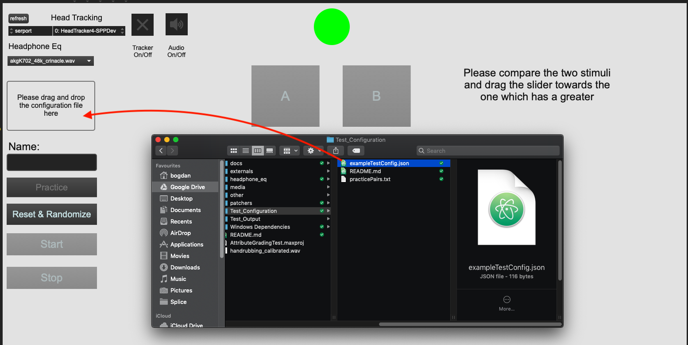

# Subjective grading test for spatial impression attributes in a concert hall

## Prerequisites:

1. Install the CH340 USB-Serial driver. Instructions for Mac and Windows are available here: https://sparks.gogo.co.nz/ch340.html
2. Install Max/MSP: https://cycling74.com/downloads You don't need a subscription in order to run the test. After the 30 day trial you can still run any patch but without being able to save.

### Windows users

For the binauralisation functions to work, you will need to place some extra DLL files in your Max install folder. These are in the "Windows Dependencies" folder of the latest release. Depending on the bit-ness you use, these should be placed in either:

 * "C:\Program Files (x86)\Cycling '74\Max" for 32-bit Max,
 * "C:\Program Files\Cycling '74\Max" for 64-bit Max.

## Calibrating the playback level
- Before you start the test, you need to calibrate the playback level of your audio interface using the calibration file handrubbing_calibrated.wav, which is included on the top level of the "AttributeGradingTest" folder.
- The file is a recording of hands rubbed at a high strength and moderately high speed.

1. Play the file over the headphones for a few seconds.
2. Take the headphones off, and rub your hands up and down, right in front of your nose, with both hands pointing straight up. Do this at a similar speed to what you hear in the recording.
3. Repeat the above process to compare the recording and your own hand rubbing sound in terms of perceived loudness, and adjust the playback level of your audio interface to match the loudness.

## Opening the test

To launch the listening test please locate the "AttributeGradingTest.maxproj" and open it using Max. **Please note that the test will take a few moments to load, sometimes even up to more than a minute.**

## Connecting the head tracker to Max

1. Connect the head tracker to the computer using a USB-Mini-B cable.
2. Locate the "Head Tracking" section in the upper-left corner of the Max patch.
3. Select the **"wchusbserialxxxx"** (for Mac) or **"COMxx"** (for Windows, depending on the serial port used for the tracker) option in the dropdown menu; If you can not find the option, press the refresh button and it should now appear. If it still does not appear please make sure that you installed the CH340 drivers correctly and logged out or restarted the machine such that changes were applied.
4. Activate the head tracking by pressing the "Tracker On/Off" button.

## Calibrating the head tracker

- Every time you mount the head tracker to a new position you **need** to follow the following steps in order to calibrate the head tracker.
- Please note that the head tracker might be drifting during the first minutes of operation. If this is the case, move the head tracker in an figure-of-eight motion for a little bit of time. Alternatively, leave the tracker powered on for a while until it no longer drifts.

1. Position your head looking straight ahead at your screen.
2. Press the button located on top of the head tracker for longer than 1 second.
3. Position you head again to look down at the floor.
4. Short-press the calibration button (< 1s).

- Now the head tracker is calibrated for the specific position it is currently mounted. It is recommended you do follow these steps every time you start a test or take the headphones off.

* **If the tracker starts drifting after a while, you can always press the button shortly (< 1s) to re-centre.**

- Locate the position indicator in the top-centre of the Max patch. This will show you when to reposition your head if it goes out of the +/- 7° range.

- The green indicator tells you that that your head is in the central position.

- The two red arrows will indicate in which direction to rotate your head such that it is in the central position again.

## Running the listening test

1. Make sure you have selected your audio interface as an output device and set the sampling rate to 48kHz from the "Options -> Audio Status" menu.
2. Make sure the "Audio On/Off" button is active.
3. To run a listening test you need to first drag and drop a test configuration file from the "Test_Configuration" folder, into the box located on the left of the screen.

4. Type your surname in the name box. Please don't include any special characters in this field (i.e. space, return):
5. To start a short practice run press the button labeled  **"Practice"**. A red border will indicate that practice mode is active.

6. Press **"Reset and Randomize"**
7. When you are ready to start the test press **"Start"**. You can now start the listening test. Please note that the the "Next" and "Previous" options will be disabled until all the sliders are moved.
8. When you are finished, don't forget to press the **"Stop"** button. This will save your results in the "Test_Ouptut" folder.
9. To start the main test session deactivate the **"Practice** button and repeat steps 6-8 to complete the test session.

## Test structure

- The test is split into 7 sessions, each with a corresponding configuration file beginning with "configFile_".
- For each session, please follow previous steps 3-9 until all sessions are finished.

- You will be presented with a number of test trials, comprised of two listening positions, "A" and "B". The goal of the test is to compare the two stimuli and indicate which one is perceptually greater (wider, further, louder, brighter depending on the assessed attribute)
- Please listen carefully to both stimuli, by clicking on them or using the keyboard shortcuts (a-for stimulus A, s-for stimulus B). (space bar - Play/Pause)
- To compare the pair of stimuli please drag the slider to the side which corresponds to the stimulus which has a greater magnitude of the assessed attribute (e.g. when comparing A and B, if A has a perceptually larger LEV please drag the slider towards A and vice-versa).
- The slider **can not** be left in the centre position. A red border will indicate that it has to be changed, unlocking the next trial.

-  It is important when comparing the stimuli to focus **only** on the assessed attribute. Please disregard changes in head orientation or position unless the attribute is assessing them.
- Please don't forget to close your eyes whilst listening to the stimuli.

## Test attributes and definitions

- There are 7 attributes to be assessed:

  * PSL (Perceived Source Loudness):
    - The perceived loudness of just the sound source. (Quiet - Loud)
  * LEV (Listener Envelopment):
    - The feeling of being surrounded by the reverberant field. (Less - More)
  * ARW (Apparent Reverb Width):
    - The perceived impression of width given by the late reverberant field. (Narrow-Wide)
  * ASD (Apparent Source Distance):
    - The perceived distance between the listener and the sound source. (Close - Far)
  * PRL (Perceived Reverb Loudness):
    - The perceived loudness of just the reverberant field . (Quiet-Loud)
  * Reverb Brightness:
    - The timbral characteristics of reverberation depending on the level of high frequencies.	(Bright-Dull)
  * Echo Brightness:
    - The timbral characteristics of echoes depending on the level of high frequencies. (Bright-Dull)
